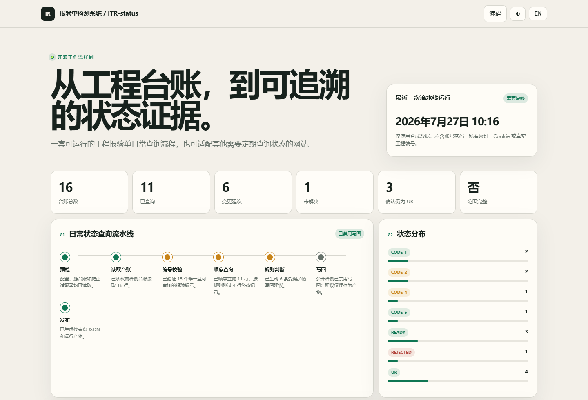
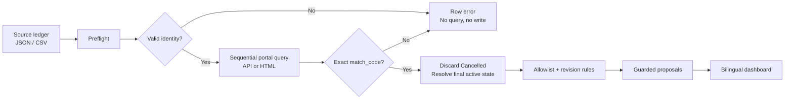

<div align="center">

# ITR-status

### Inspection Checker

**Turn an inspection ledger into verified website status evidence and a daily dashboard.**

[](https://github.com/WeaJpp/ITR-status/actions/workflows/pages.yml)
[](https://weajpp.github.io/ITR-status/?lang=en)
[](#run-locally)
[](LICENSE)

[Live demo](https://weajpp.github.io/ITR-status/?lang=en) ·
[Adaptation guide](docs/adaptation-guide.md) ·
[Architecture](docs/architecture.md) ·
[简体中文](README.md)

</div>

<p align="center">
  <a href="https://weajpp.github.io/ITR-status/?lang=en">
    
  </a>
</p>

> [!NOTE]
> Built for daily engineering Inspection Request / Inspection & Test Report checks, but adaptable to any authorized website that requires routine identity searches, status verification, or attachment downloads.

## The problem it solves

Inspection status is often split across a ledger, a portal, and downloadable evidence. Repeating the lookup manually is slow and risks identity mismatches, historical-state mistakes, cancelled submissions, and incorrect revision targeting.



## Highlights

| Capability | Implementation |
|---|---|
| Ledger input | Built-in JSON and CSV; extensible to Excel, databases, or Google Sheets |
| Portal queries | Sanitized JSON API or a custom Playwright HTML adapter |
| Identity safety | Every response must exactly match the requested `match_code` |
| Status safety | Cancelled entries are discarded; final values are allowlisted |
| Revision control | Targets ledger `REV-00...REV-NN` columns instead of guessing |
| Fail closed | Malformed, mismatched, conflicting, or incomplete rows produce no proposal |
| Public safety | Demo enforces `writeback.enabled=false` |
| Automation | Tests, data generation, and GitHub Pages deployment in Actions |

## Two adaptation paths

| Inspect it yourself | Give it to an AI |
|---|---|
| Use DevTools Network → Fetch/XHR to identify query, pagination, and authorized download APIs. Fall back to stable Playwright HTML selectors only when necessary. | Copy the prompt from the live page and give it to a browser-and-code capable AI. It instructs the AI to remain read-only, keep secrets external, verify exact identity, and add fixtures plus tests. |
| [Read method A →](docs/adaptation-guide.md#method-a-inspect-the-api-or-html-yourself) | [Read method B →](docs/adaptation-guide.md#method-b-use-the-ai-prompt) |

## Windows desktop app

For a no-command-line workflow, download the Windows artifact from [Build Windows desktop app](https://github.com/WeaJpp/ITR-status/actions/workflows/desktop.yml). The EXE imports JSON, CSV, or XLSX ledgers, runs the read-only pipeline, and opens the generated dashboard locally. It always keeps `writeback.enabled=false`.

Build it from source with `.\build_desktop.ps1`. See the [Chinese desktop guide](docs/desktop.zh-CN.md) for the current UI walkthrough.

## Run locally

The pipeline uses only the Python standard library.

```bash
git clone https://github.com/WeaJpp/ITR-status.git
cd ITR-status

python -m unittest discover -s tests -v
python scripts/run_pipeline.py --config config.example.json
python -m http.server 8000 --directory public
```

Open <http://localhost:8000/?lang=en>.

## Adapter contract

One portal query returns one exact identity and its submission history:

```json
{
  "match_code": "DEMO-GQC-IR-00001",
  "submissions": [
    {
      "label": "Issued For Inspection",
      "lifecycle": "Active",
      "updated_at": "2026-07-27T05:10:00Z"
    }
  ]
}
```

The pipeline handles exact identity verification, cancelled-entry filtering, the status allowlist, and revision targeting.

## Security boundary

> [!IMPORTANT]
> This repository contains synthetic data only. Never commit real credentials, cookies, tokens, private URLs, workbook IDs, project identities, or production attachments.

Keep authentication in environment variables or a private secret store. Begin with a minimal read-only scope. Stop on MFA, CAPTCHA, permission failure, or any status that cannot be proven. Production writeback belongs in a separately reviewed private component with backups, audit logs, and readback verification.

See [SECURITY.md](SECURITY.md) and the [adaptation guide](docs/adaptation-guide.md).

## Contributors

- [WeaJpp](https://github.com/WeaJpp) — creator and domain workflow
- [OpenAI Codex](https://github.com/codex) — implementation collaborator

---

<div align="center">

If this project helps you, consider giving it a ⭐

MIT License

</div>
