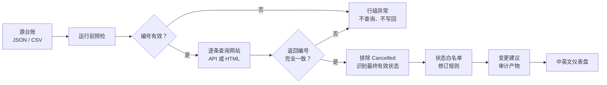

<div align="center">

# 报验单检测系统

### ITR-status

**从工程台账出发，自动查询网站状态，生成可追溯的日报与仪表盘。**

[](https://github.com/WeaJpp/ITR-status/actions/workflows/pages.yml)
[](https://weajpp.github.io/ITR-status/?lang=zh)
[](#本地运行)
[](LICENSE)

[在线演示](https://weajpp.github.io/ITR-status/?lang=zh) ·
[接入教程](docs/adaptation-guide.zh-CN.md) ·
[架构说明](docs/architecture.zh-CN.md) ·
[English](README.en.md)

</div>

<p align="center">
  <a href="https://weajpp.github.io/ITR-status/?lang=zh">
    
  </a>
</p>

> [!NOTE]
> 这是为工程报验单（IR / ITR）日常状态查询而做的开源参考实现，也可以适配任何需要定期登录、搜索编号、核对状态或下载获授权附件的网站。

## 它解决什么问题

工程报验状态常常分散在台账、网站和附件里。人工每天重复查询，不仅耗时，还容易出现查错编号、取到历史状态、漏掉取消提交或写错修订列的问题。

这个项目把查询过程拆成可验证的流水线：



## 核心能力

| 能力 | 实现方式 |
|---|---|
| 台账读取 | 内置 JSON、CSV 适配器，可扩展 Excel、数据库或 Google Sheet |
| 网站查询 | 支持脱敏 JSON API；也可实现 Playwright HTML 适配器 |
| 精确匹配 | 查询后必须验证 `match_code` 与请求编号完全一致 |
| 状态判断 | 排除 `Cancelled`，只接受明确的状态白名单 |
| 状态映射 | `Issued For Inspection → UR`，`Ready for Sign Off/Out → READY` |
| 修订控制 | 依据台账中的 `REV-00...REV-NN`，不从文件名盲猜 |
| 失败关闭 | `pending`、错配编号、冲突状态或缺失修订列均不产生写回 |
| 公开安全 | 示例强制 `writeback.enabled=false`，只生成建议产物 |
| 双语界面 | 首次打开默认中文，可切换完整英文界面 |
| 自动发布 | GitHub Actions 测试、生成数据并部署 GitHub Pages |

## 两种接入方法

<table>
<tr>
<td width="50%" valign="top">

### A. 自己分析 API / HTML

适合熟悉浏览器开发者工具、HTTP 或 Playwright 的用户。

1. 取得目标网站的自动查询授权。
2. 用一个测试编号人工查询。
3. 在 `Network → Fetch/XHR` 找查询、分页和下载接口。
4. 没有稳定 API 时，再定位搜索框、结果卡片和附件链接。
5. 实现 `PortalAdapter`，先跑离线测试和只读预检。

[查看完整接入步骤 →](docs/adaptation-guide.zh-CN.md#方法-a自己分析-html-或-api)

</td>
<td width="50%" valign="top">

### B. 让 AI 帮你适配

适合希望由 Codex、Claude Code 等具备浏览器与代码能力的 AI 完成接入的用户。

1. 打开在线仪表盘底部的“把它接到你的网站”。
2. 点击“复制提示词”。
3. 填入授权网站地址、台账格式和编号字段。
4. 让 AI 识别 API/HTML、生成适配器、fixture 和测试。
5. 人工确认查询范围和所有潜在写操作。

[复制完整 AI 提示词 →](docs/adaptation-guide.zh-CN.md#方法-b交给-ai-完成适配)

</td>
</tr>
</table>

## Windows 桌面版（推荐）

不想安装 Python 或使用命令行，可以直接使用 Windows EXE 工作台：选择 JSON / CSV / XLSX 台账，选择离线结果或私有 JSON 网关，点击运行后查看进度、错误、变更建议和本地仪表盘。

- 在 [Actions → Build Windows desktop app](https://github.com/WeaJpp/ITR-status/actions/workflows/desktop.yml) 下载最新构建产物。
- 程序默认只读，强制 `writeback.enabled=false`，不会修改源台账。
- 编号规则可配置，但网站返回编号仍必须与请求完全一致。
- 完整说明：[Windows 桌面版使用说明](docs/desktop.zh-CN.md)。

从源码一键构建：

```powershell
.\build_desktop.ps1
```

生成 `dist\ITR-status-Desktop.exe`。

## 本地运行

流水线只使用 Python 标准库，不需要安装第三方包。

```bash
git clone https://github.com/WeaJpp/ITR-status.git
cd ITR-status

python -m unittest discover -s tests -v
python scripts/run_pipeline.py --config config.example.json
python -m http.server 8000 --directory public
```

打开 <http://localhost:8000>。

也可以强制指定语言：

- 中文：<http://localhost:8000/?lang=zh>
- English：<http://localhost:8000/?lang=en>

## 适配器返回契约

无论底层来自 API 还是 HTML，`PortalAdapter` 每次只查询一个编号，并返回统一结构：

```json
{
  "match_code": "DEMO-GQC-IR-00001",
  "submissions": [
    {
      "label": "Issued For Inspection",
      "lifecycle": "Active",
      "updated_at": "2026-07-27T05:10:00Z"
    }
  ]
}
```

流水线会在此基础上完成精确编号核对、取消记录过滤、状态白名单和修订规则判断。

## 生成结果

运行完成后会生成：

```text
public/data/dashboard.json          网页数据
artifacts/run_summary.json          本次运行汇总
artifacts/proposed_writeback.json   待审核的变更建议
artifacts/errors.json               未解决记录
```

## 安全边界

> [!IMPORTANT]
> 本仓库只包含合成数据。不要提交真实账号、密码、Cookie、Token、私有网址、工作簿 ID、项目编号或生产附件。

- 认证信息只从环境变量或私有密钥存储读取。
- 接入新网站时，先用最小测试范围和只读模式。
- 查询结果必须能与请求编号精确对应。
- MFA、验证码、权限异常或无法证明的状态一律停止，不绕过。
- 生产写回应放在独立私有组件中，并配套备份、审计和写后回读。

更多内容见 [SECURITY.md](SECURITY.md)。

<details>
<summary><strong>查看项目结构</strong></summary>

```text
src/itr_pipeline/
├── adapters.py       台账与网站适配器
├── engine.py         查询流水线
├── models.py         数据契约
└── rules.py          编号、状态与修订规则

scripts/run_pipeline.py  命令行入口
sample_data/             合成台账与门户响应
tests/                   安全规则与流程测试
public/                  仪表盘与接入提示词
docs/                    架构及接入教程
.github/workflows/       测试、生成与部署
```

</details>

## 贡献

欢迎提交问题和改进。涉及编号、状态、修订或写回规则的变化，必须同时增加针对性测试。

提交前运行：

```bash
python -m unittest discover -s tests -v
python scripts/run_pipeline.py --config config.example.json
node --check public/app.js
```

参见 [CONTRIBUTING.md](CONTRIBUTING.md)。

## 贡献者

- [WeaJpp](https://github.com/WeaJpp) — 创建者与业务流程设计
- [OpenAI Codex](https://github.com/codex) — 实现协作者

---

<div align="center">

如果这个项目对你有帮助，可以给它一个 ⭐

MIT License

</div>
